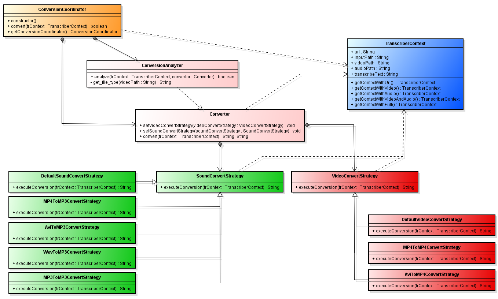

# Documentation for Functionality

This documentation provides an overview of the functionality and usage of the provided feature. The feature facilitates the conversion of audio and video files using various strategies based on file types.

## Usage

To utilize the functionality, follow the steps below:

1. **Import Required Modules:**

    ```python
    from convertor.ConversionCoordinator import *
    from TranscriberContext import *
    ```

2. **Create Transcriber Context:**

    ```python
    trContextVideoInput = TranscriberContext.getContextWithVideo()
    ```

3. **Initialize Conversion Coordinator:**

    ```python
    converterCoordinator = ConversionCoordinator.getConversionCoordinator()
    ```

4. **Perform Conversion:**

    ```python
    wasConverted = converterCoordinator.convert(trContextVideoInput)
    ```

## Files and Classes

### ConversionCoordinator

- **Purpose:** Coordinates analysis and conversion of files.
- **Usage:** Responsible for setting strategies and executing conversions.

### ConversionAnalyzer

- **Purpose:** Analyzes file types to determine conversion strategies.
- **Usage:** Analyzes file types and sets conversion strategies accordingly.

### Convertor

- **Purpose:** Converts files based on specified strategies.
- **Usage:** Executes the conversion process using predefined strategies.

### VideoConvertStrategy

- **Purpose:** Implements strategies for video file conversion.
- **Usage:** Defines strategies for converting various video formats.

### SoundConvertStrategy

- **Purpose:** Implements strategies for audio file conversion.
- **Usage:** Defines strategies for converting different audio formats.


## Class Diagram

<p align="center">
  
</p>

## Example

```python
from convertor.ConversionCoordinator import *
from TranscriberContext import *

# Create a Transcriber Context with video input
trContextVideoInput = TranscriberContext.getContextWithVideo()

# Initialize Conversion Coordinator
converterCoordinator = ConversionCoordinator.getConversionCoordinator()

# Perform conversion
wasConverted = converterCoordinator.convert(trContextVideoInput)
```

## Notes

- Ensure all required modules are installed (**`moviepy`**, **`pydub`**, etc.).
- Verify file paths and types before conversion.
- Customize strategies and error handling as needed.

## Contributors

- Ethan Carollo
- Emmanuel Moulin