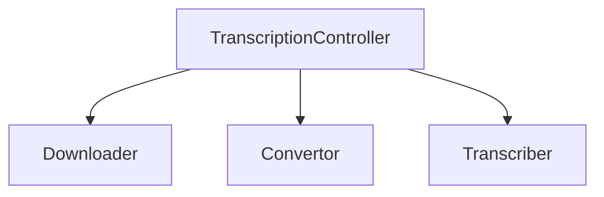

# The Transcription Controller

>(for reading this md, we recommend to install https://open-vsx.org/vscode/item?itemName=bierner.markdown-mermaid if you are on vscode)

Basically, the role of the transcription controller is to provide a simple interface for working with the different modules of the system.

The role of the TranscriptionController is to meet the user's need for our system to have a simple interface, and to simply pass an input to receive a TranscriberContext.

So for that, the TranscriptionController directly needs to use the different services available (Downloader, Convertor, Transcriber)

> Here is an example of what the TranscriptionController instantiate and call

